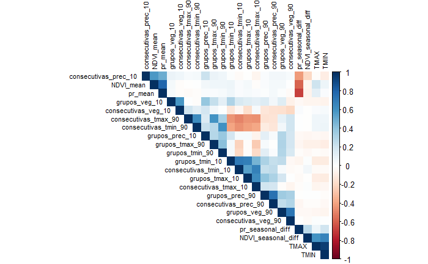

```{r setup, include=FALSE}
knitr::opts_chunk$set(echo = TRUE, warning = FALSE, message = FALSE)
```

## Librerías

Selección de todas las librerías para modelar y entrenar, desde preprocesamiento hasta validación cruzada y optimización de hiperparámetros

```{r libraries, results = FALSE}
library(tidymodels)
library(haven)
library(magrittr)
library(fs)
library(readr)
library(dplyr)
library(dials)
library(corrplot)
library(ggplot2)
library(yardstick)
library(randomForest)
library(DiagrammeR)
```

## Carga de datasets

Tenemos 5 datasets (1 por año)

```{r datasets, results=FALSE}
# 1. Function to read all years.................................................
set.seed(123)

read_and_mutate_malnutrition <- function() {
  malnutrition_list <- list()
  for (year in 14:19) {
    path <- file.path(paste0("dataset/malnutrition_final", year, ".csv"))
    malnutrition <- read_csv(path) %>%
      mutate(HHID = as.character(HHID))
    malnutrition_list[[paste0("malnutrition_", year)]] <- malnutrition
  }
  return(malnutrition_list)
}

# Llama a la función para cargar los datos de todos los años
malnutrition_data <- read_and_mutate_malnutrition()

malnutrition_14 <- malnutrition_data[["malnutrition_14"]] %>%
  mutate(malnutrition = as.factor(malnutrition), year = 2014, 
         TGAP = TMAX - TMIN) %>%
  group_by(malnutrition) %>%
  sample_n(size = 200, replace = TRUE) 

malnutrition_15 <- malnutrition_data[["malnutrition_15"]] %>%
  mutate(malnutrition = as.factor(malnutrition), year = 2015,
         TGAP = TMAX - TMIN) %>%
  group_by(malnutrition) %>%
  sample_n(size = 200, replace = TRUE) 

malnutrition_16 <- malnutrition_data[["malnutrition_16"]] %>%
  mutate(malnutrition = as.factor(malnutrition), year = 2016,
         TGAP = TMAX - TMIN) %>%
  group_by(malnutrition) %>%
  sample_n(size = 200, replace = TRUE) 

malnutrition_17 <- malnutrition_data[["malnutrition_17"]] %>%
  mutate(malnutrition = as.factor(malnutrition), year = 2017,
         TGAP = TMAX - TMIN) %>%
  group_by(malnutrition) %>%
  sample_n(size = 200, replace = TRUE) 

malnutrition_18 <- malnutrition_data[["malnutrition_18"]] %>%
  mutate(malnutrition = as.factor(malnutrition), year = 2018,
         TGAP = TMAX - TMIN) %>%
  group_by(malnutrition) %>%
  sample_n(size = 200, replace = TRUE) 

malnutrition_19 <- malnutrition_data[["malnutrition_19"]] %>%
  mutate(malnutrition = as.factor(malnutrition), year = 2019,
         TGAP = TMAX - TMIN) %>%
  group_by(malnutrition) %>%
  sample_n(size = 200, replace = TRUE) 

malnutrition_total <- rbind(malnutrition_14,malnutrition_15,
                            malnutrition_16,malnutrition_17,
                            malnutrition_18,malnutrition_19)

```

## Analisis Exploratorio de la Data

```{r corr, results=FALSE}
# Selecciona las variables de interés
selected_vars<- c(
  "grupos_veg_90", "grupos_veg_10",
  "grupos_prec_90", "grupos_prec_10",
  "grupos_tmax_90", "grupos_tmax_10",
  "grupos_tmin_90", "grupos_tmin_10",
  "consecutivas_veg_90", "consecutivas_veg_10",
  "consecutivas_prec_90", "consecutivas_prec_10",
  "consecutivas_tmax_90", "consecutivas_tmax_10",
  "consecutivas_tmin_90", "consecutivas_tmin_10",
  "NDVI_mean",  
  "NDVI_seasonal_diff", 
  "pr_mean", "pr_seasonal_diff", 
  "TMAX", "TMIN"
)

# Crea una matriz de correlación
correlation_matrix <- cor(malnutrition_total[, selected_vars])

# Crea el corrplot
corrplot(correlation_matrix, method = "color", tl.cex = 0.7, tl.col = "black", type = "upper", order = "hclust")

```

### Correlación

En primer lugar, verificamos cómo se comportan las variables unas con otras, 
para seleccionar aquellas que no tengan tan alta correlación entre sí,
debido a que dependiendo del modelo esta colinealidad podría afectar su desempeño.


```{r histograms}
#2.  Crear histogramas para las variables numéricas continuas...................

# Gráfico para pr_mean
ggplot(malnutrition_total, aes(x = pr_mean, fill = malnutrition)) + 
  geom_histogram(colour = "black",
                 lwd = 0.75,
                 linetype = 1,
                 position = "identity") +
  facet_wrap(~year) + 
  labs(title ="Distribución de pr_mean a través de los años, sample = 200")

# Gráfico para pr_seasonal_diff
ggplot(malnutrition_total, aes(x = pr_seasonal_diff, fill = malnutrition)) + 
  geom_histogram(colour = "black",
                 lwd = 0.75,
                 linetype = 1,
                 position = "identity") +
  facet_wrap(~year) + 
  labs(title ="Distribución de pr_seasonal_diff a través de los años, sample = 200")


# Gráfico para NDVI_mean
ggplot(malnutrition_total, aes(x = NDVI_mean, fill = malnutrition)) + 
  geom_histogram(colour = "black",
                 lwd = 0.75,
                 linetype = 1,
                 position = "identity") +
  facet_wrap(~year) + 
  labs(title ="Distribución de NDVI_mean a través de los años, sample = 200")

# Gráfico para NDVI_seasonal_diff
ggplot(malnutrition_total, aes(x = NDVI_seasonal_diff, fill = malnutrition)) + 
  geom_histogram(colour = "black",
                 lwd = 0.75,
                 linetype = 1,
                 position = "identity") +
  facet_wrap(~year) + 
  labs(title ="Distribución de NDVI_seasonal_diff a través de los años, sample = 200")


# Gráfico para TGAP

ggplot(malnutrition_total, aes(x = TGAP, fill = malnutrition)) + 
  geom_histogram(colour = "black",
                 lwd = 0.75,
                 linetype = 1,
                 position = "identity") +
  facet_wrap(~year) + 
  labs(title ="Distribución de TGAP a través de los años, sample = 200")


# 3. Crear histograms para las variables numéricas  ..............................

# Gráfico de boxplot para consecutivas_veg_90
ggplot(malnutrition_total, aes(x = consecutivas_veg_90, fill = malnutrition)) +
  geom_bar(colour = "black",
           lwd = 0.25,
           linetype = 1,
           position = "jitter") +
  facet_wrap(~ year) +
  labs(title = "Conteo de consecutivas_veg_90 por año, sample = 200") +
  xlab("Consecutivas_veg_90") +
  ylab("Conteo")

# Gráfico de boxplot para consecutivas_prec_90
ggplot(malnutrition_total, aes(x = consecutivas_prec_90, fill = malnutrition)) +
  geom_bar(colour = "black",
           lwd = 0.25,
           linetype = 1,
           position = "jitter") +
  facet_wrap(~ year) +
  labs(title = "Conteo de consecutivas_prec_90 por año, sample = 200") +
  xlab("consecutivas_prec_90") +
  ylab("Conteo")

# Gráfico de boxplot para consecutivas_tmax_90
ggplot(malnutrition_total, aes(x = consecutivas_tmax_90, fill = malnutrition)) +
  geom_bar(colour = "black",
           lwd = 0.25,
           linetype = 1,
           position = "jitter") +
  facet_wrap(~ year) +
  labs(title = "Conteo de consecutivas_tmax_90 por año, sample = 200") +
  xlab("consecutivas_tmax_90") +
  ylab("Conteo")

# Gráfico de barras (histograma) para consecutivas_tmin_90
ggplot(malnutrition_total, aes(x = consecutivas_tmin_90, fill = malnutrition)) +
  geom_histogram(colour = "black", 
                 size = 0.25, 
                 linetype = 1,
                 position = "jitter", 
                 binwidth = 0.5) +
  facet_grid(malnutrition ~ year) +
  labs(title = "Conteo de consecutivas_tmin_90 por año, sample = 200") +
  xlab("consecutivas_tmin_90") +
  ylab("Conteo") +
  scale_y_sqrt()
```
Histograma (distribución) de cada variable en los niveles de desnutrición aguda. Fuente: Elaboración propia

### Histogramas

Consecuentemente, queremos ver las distribuciones de las variables y comprobar si
tienen distribuciones normales o si por el contrario presentan alguna forma distinta,
de esta manera podemos escoger una estrategia de escalamiento de los datos.


```{r boxplot}

# 4. Gráfico de boxplots para pr_mean, pr_seasonal_diff, NDVI_mean, NDVI_seasonal_diff y TGAP

malnutrition_14 <- malnutrition_data[["malnutrition_14"]] %>%
  mutate(malnutrition = as.factor(malnutrition), year = 2014, 
         TGAP = TMAX - TMIN) %>%
  sample_n(size = 2000, replace = TRUE) 

malnutrition_15 <- malnutrition_data[["malnutrition_15"]] %>%
  mutate(malnutrition = as.factor(malnutrition), year = 2015,
         TGAP = TMAX - TMIN) %>%
  sample_n(size = 2000, replace = TRUE) 

malnutrition_16 <- malnutrition_data[["malnutrition_16"]] %>%
  mutate(malnutrition = as.factor(malnutrition), year = 2016,
         TGAP = TMAX - TMIN) %>%
  sample_n(size = 2000, replace = TRUE) 

malnutrition_17 <- malnutrition_data[["malnutrition_17"]] %>%
  mutate(malnutrition = as.factor(malnutrition), year = 2017,
         TGAP = TMAX - TMIN) %>%
  sample_n(size = 2000, replace = TRUE) 

malnutrition_18 <- malnutrition_data[["malnutrition_18"]] %>%
  mutate(malnutrition = as.factor(malnutrition), year = 2018,
         TGAP = TMAX - TMIN) %>%
  sample_n(size = 2000, replace = TRUE) 

malnutrition_19 <- malnutrition_data[["malnutrition_19"]] %>%
  mutate(malnutrition = as.factor(malnutrition), year = 2019,
         TGAP = TMAX - TMIN) %>%
  sample_n(size = 2000, replace = TRUE) 

malnutrition_total <- rbind(malnutrition_14,malnutrition_15,
                            malnutrition_16,malnutrition_17,
                            malnutrition_18,malnutrition_19)


ggplot(malnutrition_total, aes(x = malnutrition, y = pr_mean, fill = malnutrition)) +
  geom_boxplot() +
  facet_wrap(~ year) +
  labs(title = "Distribución de pr_mean por malnutrition") +
  scale_fill_manual(values = c("0" = "blue", "1" = "red"))

ggplot(malnutrition_total, aes(x = malnutrition, y = pr_seasonal_diff, fill = malnutrition)) +
  geom_boxplot() +
  facet_wrap(~ year) +
  labs(title = "Distribución de pr_seasonal_diff por malnutrition") +
  scale_fill_manual(values = c("0" = "blue", "1" = "red"))

ggplot(malnutrition_total, aes(x = malnutrition, y = NDVI_mean, fill = malnutrition)) +
  geom_boxplot() +
  facet_wrap(~ year) +
  labs(title = "Distribución de NDVI_mean por malnutrition") +
  scale_fill_manual(values = c("0" = "blue", "1" = "red"))

ggplot(malnutrition_total, aes(x = malnutrition, y = NDVI_seasonal_diff, fill = malnutrition)) +
  geom_boxplot() +
  facet_wrap(~ year) +
  labs(title = "Distribución de NDVI_seasonal_diff por malnutrition") +
  scale_fill_manual(values = c("0" = "blue", "1" = "red"))

ggplot(malnutrition_total, aes(x = malnutrition, y = TGAP, fill = malnutrition)) +
  geom_boxplot() +
  facet_wrap(~ year) +
  labs(title = "Distribución de TGAP por malnutrition") +
  scale_fill_manual(values = c("0" = "blue", "1" = "red"))


```

Gráfico de cajas y bigotes para cada variable climatológica en los niveles de desnutrición. Fuente: Elaboración Propia

### Cajas y bigotes

Finalmente, visualizamos cajas y bigotes para visualizar de forma general la cantidad
de outliers de las diferentes variables y al mismo tiempo verificar si las distribuciones
entre observaciones de niños con o sin desnutrición son similares o difieren en cuartiles,
rango, etc.


## Pre procesamiento

Seleccionamos el training y test set. En el caso del entrenamiento tomamos los años 2014 a X. Test sería el año siguiente a X.

```{r preprocess, results = FALSE}

# Vector general de variables descriptivas
opt_1 <- c(
  "NDVI_mean",  
  "NDVI_seasonal_diff", 
  "pr_mean", "pr_seasonal_diff", 
  "TMAX", "TMIN"
)

# Vector de umbrales 90/10
opt_2 <- c(
  "NDVI_high_90", "NDVI_low_10", "pr_high_90", "pr_low_10",
  "tmax_high_90", "tmin_low_10"
)

# Vector de umbrales 99/1
opt_3 <- c(
  "NDVI_high_99", "NDVI_low_1", "pr_high_99", "pr_low_1",
  "tmax_high_99", "tmin_low_1"
)

# Vector de umbrales 95/5
opt_4 <- c(
  "NDVI_high_95", "NDVI_low_5", "pr_high_95", "pr_low_5",
  "tmax_high_95", "tmin_low_5"
)

# Vector de meses consecutivos por encima o debajo de umbral
opt_5 <- c(
  "consecutivas_veg_90", "consecutivas_veg_10",
  "consecutivas_prec_90", "consecutivas_prec_10",
  "consecutivas_tmax_90", "consecutivas_tmax_10",
  "consecutivas_tmin_90", "consecutivas_tmin_10"
)

# Vector de grupos de meses consecutivos 
opt_6 <- c(
  "grupos_veg_90", "grupos_veg_10",
  "grupos_prec_90", "grupos_prec_10",
  "grupos_tmax_90", "grupos_tmax_10",
  "grupos_tmin_90", "grupos_tmin_10"
)

# Crear conjuntos de entrenamiento y prueba
sets <- create_training_and_test_sets(14:18, 19, c(opt_1,opt_5,opt_6))
training_set <- sets$training_set %>%
  mutate(TGAP = TMAX - TMIN) %>%
  select(-TMAX, -TMIN)
test_set <- sets$test_set %>%
  mutate(TGAP = TMAX - TMIN) %>%
  select(-TMAX, -TMIN)
```


## Cross validation - Hyperparameters Optimization

Utilizamos una búsqueda de valores aleatorios y dividimos 3 folds de validación.
Los hiperparámetros a configurar son: mtry, min_n y trees.

```{r crossval, eval = FALSE}
#Train test split

data_train <- training_set
data_test  <- test_set

# Crear un objeto recipe para preprocesamiento
rec <- recipe(malnutrition ~ ., data = data_train) %>%
  step_center(all_numeric()) %>%
  step_scale(all_numeric())

# Preprocesamiento
rec_preprocessed <- prep(rec)

# Aplicar receta de preprocesamiento a los datos
malnutrition_preprocessed <-
  recipes::bake(
    rec_preprocessed, 
    new_data = data_train
  ) %>%  
  rsample::vfold_cv(v = 3, strata = "malnutrition", breaks = 3)

# Definir la fórmula del modelo
formula <- "malnutrition ~ ."

rf_spec <- rand_forest(
  mtry = tune(),
  min_n = tune(),
  trees = tune()
) %>%
  set_engine("randomForest") %>%
  set_mode("classification")

rf_params <- 
  dials::parameters(
    mtry(),
    min_n(),
    trees()
  ) %>%
  dials::finalize(data_train %>% select(-malnutrition))

rf_grid <- 
  dials::grid_random(
    rf_params, 
    size =  10
  )

knitr::kable(head(rf_grid))

rf_wf <- 
  workflows::workflow() %>%
  add_model(rf_spec) %>% 
  add_formula(malnutrition ~ .)
```

A partir de acá, se hace la búsqueda de hiperparámetros y el cross-validation.
 
```{r hypercross, eval = FALSE}
# Sintonizacion de hiperparametros
rf_tuned <- tune::tune_grid(
  object = rf_wf,
  resamples = malnutrition_preprocessed,
  grid = rf_grid,
  metrics = yardstick::metric_set(accuracy, sens),
  control = tune::control_grid(verbose = TRUE)
)
```
 
 
### Muestra de hiperparámetros probados 
 
```{r hyperlist, eval = FALSE}
#Mejores parametros para ver accuracy recall y precision

library(kableExtra)

params_rf_ndvi <- rf_tuned %>%
  tune::show_best(metric = "sens") %>%
  dplyr::slice(1:20) %>%
  knitr::kable() %>%
  kable_styling("striped")

models_results<- collect_metrics(rf_tuned)

# Guardar la tabla en formato CSV
write_csv(models_results, "RF_19_opt6.csv")

writeLines(capture.output(params_rf_ndvi), "params_rf_19_opt6.html")

rf_best_params <- rf_tuned %>%
  tune::select_best("sens")

knitr::kable(rf_best_params)


rf_model_final <- rf_spec %>% 
  finalize_model(rf_best_params)
```

### 2014-2015 para 2016 para la opción 1

```{r 2016}
RF_2019_56 <- read_csv("models/RF/Version September/2019/RF_19_opt156_final.csv") %>%
  mutate(.config = gsub("Preprocessor1_", "", .config))
head(RF_2019_56, n = 60)
```


### 2014-2016 para 2017 para la opción 5

```{r 2017}
RF_2017 <- read_csv("models/RF/Version September/2017/RF_17_opt5.csv") %>%
  mutate(.config = gsub("Preprocessor1_", "", .config))
head(RF_2017, n = 10)
```


### 2014-2017 para 2018 para la opción 3

```{r 2018}
RF_2018 <- read_csv("models/RF/Version September/2018/RF_18_opt3.csv") %>%
  mutate(.config = gsub("Preprocessor1_", "", .config))
head(RF_2018, n = 10)
```


### 2014-2018 para 2019

```{r 2019}
RF_2019 <- read_csv("models/RF/Version September/2019/RF_19_opt6.csv") %>%
  mutate(.config = gsub("Preprocessor1_", "", .config))
head(RF_2019, n = 10)
```

## Evaluación out of sample

```{r}
# 2. Function to create train and test set .....................................

create_training_and_test_sets <- function(train_years, test_year, selected_vars) {
  # Crear una lista para almacenar los conjuntos de datos de entrenamiento
  training_data_list <- list()
  
  # Iterar a través de los años de entrenamiento
  for (year in train_years) {
    # Obtener el conjunto de datos correspondiente al año
    data <- malnutrition_data[[paste0("malnutrition_", year)]]
    
    # Seleccionar las columnas relevantes y convertir malnutrition a factor
    data <- data %>%
      select(
        malnutrition,  all_of(selected_vars)) %>%
      mutate(malnutrition = as.factor(malnutrition))
    
    # Almacenar el conjunto de datos en la lista
    training_data_list[[year]] <- data
  }
  
  # Combinar todos los conjuntos de datos de entrenamiento en uno solo
  training_set <- do.call(rbind, training_data_list)
  
  # Obtener el conjunto de datos correspondiente al año de prueba
  test_set <- malnutrition_data[[paste0("malnutrition_", test_year)]]
  
  # Seleccionar las mismas columnas y convertir malnutrition a factor en el conjunto de prueba
  test_set <- test_set %>%
    select(
      malnutrition,  all_of(selected_vars)) %>%
    mutate(malnutrition = as.factor(malnutrition))
  
  # Retornar el conjunto de entrenamiento y el conjunto de prueba
  return(list(training_set = training_set, test_set = test_set))
}
```


### 2014-2018 para 2019

```{r eval 19 opt156,  echo = TRUE}

# Crear conjuntos de entrenamiento y prueba
sets <- create_training_and_test_sets(14:18, 19, c(opt_1, opt_2))
training_set <- sets$training_set %>%
  mutate(TGAP = TMAX - TMIN) %>%
  select(-TMAX, -TMIN)
test_set <- sets$test_set %>%
  mutate(TGAP = TMAX - TMIN) %>%
  select(-TMAX, -TMIN)

# Crear un objeto recipe para preprocesamiento
rec <- recipe(malnutrition ~ ., data = training_set) %>%
  step_center(all_numeric()) %>%
  step_scale(all_numeric())

# Preprocesamiento
rec_preprocessed <- prep(rec)

train_processed  <- bake(rec_preprocessed, new_data = training_set)

test_processed  <- bake(rec_preprocessed, new_data = test_set)


rf_spec <- rand_forest(
  mtry = 3,
  min_n = 19,
  trees = 1305
) %>%
  set_engine("ranger", importance = 'impurity', regularization.factor = 0.5) %>%
  set_mode("classification")


rf_wf <- 
  workflow() %>% 
  add_model(rf_spec) %>% 
  add_recipe(rec_preprocessed)

rf_fit <- rf_wf %>%
  fit(data = training_set)

# Predicciones para el conjunto de entrenamiento
rf_training_pred <- 
  predict(rf_fit, training_set, type = "prob") %>%
  mutate(.pred_class =  as.factor(ifelse(.pred_1 > 0.1, "1", "0"))) %>%
  bind_cols(training_set %>% select(malnutrition))

rf_training_pred %>%                # training set predictions
  roc_auc(truth = malnutrition, .pred_1)

rf_training_pred %>%                # training set predictions
  accuracy(truth = malnutrition, .pred_class)

# Predicciones para el conjunto de prueba
rf_testing_pred <- 
  predict(rf_fit, test_set, type = "prob") %>%
  mutate(.pred_class =  as.factor(ifelse(.pred_1 > 0.1, "1", "0"))) %>%
  bind_cols(test_set %>% select(malnutrition))

rf_testing_pred %>%                   # test set predictions
  roc_auc(truth = malnutrition, .pred_1)

rf_testing_pred %>%                   # test set predictions
  accuracy(truth = malnutrition, .pred_class)

library(vip)

# Extraer el modelo ajustado del flujo de trabajo
rf_model <- pull_workflow_fit(rf_fit)

num_features <- ncol(training_set) - 1

# Generar el gráfico de importancia de variables
vip(rf_model, method = "model", num_features = num_features)

```


### Entrenamiento y métricas de evaluación 2014-2018 -> 2019

### Otras métricas
```{r metrics 19}
# VPP (Valor Predictivo Positivo)
rf_training_pred %>%
  ppv(truth = malnutrition, .pred_class)

rf_testing_pred %>%
  ppv(truth = malnutrition, .pred_class)

# VPN (Valor Predictivo Negativo)
rf_training_pred %>%
  npv(truth = malnutrition, .pred_class)

rf_testing_pred %>%
  npv(truth = malnutrition, .pred_class)

# F1-score
rf_training_pred %>%
  f_meas(truth = malnutrition, .pred_class)

rf_testing_pred %>%
  f_meas(truth = malnutrition, .pred_class)


# Matriz de confusión para el conjunto de entrenamiento
rf_training_conf_mat <- 
  rf_training_pred %>%
  conf_mat(truth = malnutrition, estimate = .pred_class)

print(rf_training_conf_mat)

# Matriz de confusión para el conjunto de prueba
rf_testing_conf_mat <- 
  rf_testing_pred %>%
  conf_mat(truth = malnutrition, estimate = .pred_class)

print(rf_testing_conf_mat)

```


```{r, echo = FALSE}
# Mostrar los resultados opt 1, opt 5 y opt 6
cat("\nAccuracy: 0.9533 \n")
cat("ROC-AUC: 0.4401 \n")
```


### 2014-2015 para 2016

### Entrenamiento y métricas de evaluación 2014 -> 2016

```{r eval 16 opt156, echo = TRUE}
# Crear conjuntos de entrenamiento y prueba
sets <- create_training_and_test_sets(14:15, 16, c(opt_1, opt_2))
training_set <- sets$training_set %>%
  mutate(TGAP = TMAX - TMIN) %>%
  select(-TMAX, -TMIN)
test_set <- sets$test_set %>%
  mutate(TGAP = TMAX - TMIN) %>%
  select(-TMAX, -TMIN)

# Crear un objeto recipe para preprocesamiento
rec <- recipe(malnutrition ~ ., data = training_set) %>%
  step_center(all_numeric()) %>%
  step_scale(all_numeric())

# Preprocesamiento
rec_preprocessed <- prep(rec)

train_processed  <- bake(rec_preprocessed, new_data = training_set)

test_processed  <- bake(rec_preprocessed, new_data = test_set)


# Crear un objeto recipe para preprocesamiento
rec <- recipe(malnutrition ~ ., data = training_set) %>%
  step_center(all_numeric()) %>%
  step_scale(all_numeric())

# Preprocesamiento
rec_preprocessed <- prep(rec)

train_processed  <- bake(rec_preprocessed, new_data = training_set)

test_processed  <- bake(rec_preprocessed, new_data = test_set)


rf_spec <- rand_forest(
  mtry = 3,
  min_n = 35,
  trees = 1353
) %>%
  set_engine("ranger", importance = 'impurity', regularization.factor = 0.5) %>%
  set_mode("classification")


rf_wf <- 
  workflow() %>% 
  add_model(rf_spec) %>% 
  add_recipe(rec_preprocessed)

rf_fit <- rf_wf %>%
  fit(data = training_set)

# Predicciones para el conjunto de entrenamiento
rf_training_pred <- 
  predict(rf_fit, training_set, type = "prob") %>%
  mutate(.pred_class =  as.factor(ifelse(.pred_1 > 0.1, "1", "0"))) %>%
  bind_cols(training_set %>% select(malnutrition))

rf_training_pred %>%                # training set predictions
  roc_auc(truth = malnutrition, .pred_1)

rf_training_pred %>%                # training set predictions
  accuracy(truth = malnutrition, .pred_class)

# Predicciones para el conjunto de prueba
rf_testing_pred <- 
  predict(rf_fit, test_set, type = "prob") %>%
  mutate(.pred_class =  as.factor(ifelse(.pred_1 > 0.1, "1", "0"))) %>%
  bind_cols(test_set %>% select(malnutrition))

rf_testing_pred %>%                   # test set predictions
  roc_auc(truth = malnutrition, .pred_1)

rf_testing_pred %>%                   # test set predictions
  accuracy(truth = malnutrition, .pred_class)

library(vip)

# Extraer el modelo ajustado del flujo de trabajo
rf_model <- pull_workflow_fit(rf_fit)

num_features <- ncol(training_set) - 1

# Generar el gráfico de importancia de variables
vip(rf_model, method = "model", num_features = num_features)
```
### Otras métricas
```{r}
# VPP (Valor Predictivo Positivo)
rf_training_pred %>%
  ppv(truth = malnutrition, .pred_class)

rf_testing_pred %>%
  ppv(truth = malnutrition, .pred_class)

# VPN (Valor Predictivo Negativo)
rf_training_pred %>%
  npv(truth = malnutrition, .pred_class)

rf_testing_pred %>%
  npv(truth = malnutrition, .pred_class)

# F1-score
rf_training_pred %>%
  f_meas(truth = malnutrition, .pred_class)

rf_testing_pred %>%
  f_meas(truth = malnutrition, .pred_class)


# Matriz de confusión para el conjunto de entrenamiento
rf_training_conf_mat <- 
  rf_training_pred %>%
  conf_mat(truth = malnutrition, estimate = .pred_class)

print(rf_training_conf_mat)

# Matriz de confusión para el conjunto de prueba
rf_testing_conf_mat <- 
  rf_testing_pred %>%
  conf_mat(truth = malnutrition, estimate = .pred_class)

print(rf_testing_conf_mat)
```


```{r, echo = FALSE}
# Mostrar los resultados opt 1, opt 5 y opt 6
cat("\nAccuracy: 0.86 \n")
cat("ROC-AUC: 0.43 \n")
```


### 2014-2016 para 2017

### Entrenamiento y métricas de evaluación 2014 -> 2017

```{r eval 17 opt156, echo = TRUE}

# Crear conjuntos de entrenamiento y prueba
sets <- create_training_and_test_sets(14:16, 17, c(opt_1, opt_2))
training_set <- sets$training_set %>%
  mutate(TGAP = TMAX - TMIN) %>%
  select(-TMAX, -TMIN)
test_set <- sets$test_set %>%
  mutate(TGAP = TMAX - TMIN) %>%
  select(-TMAX, -TMIN)

# Crear un objeto recipe para preprocesamiento
rec <- recipe(malnutrition ~ ., data = training_set) %>%
  step_center(all_numeric()) %>%
  step_scale(all_numeric())

# Preprocesamiento
rec_preprocessed <- prep(rec)

train_processed  <- bake(rec_preprocessed, new_data = training_set)

test_processed  <- bake(rec_preprocessed, new_data = test_set)


rf_spec <- rand_forest(
  mtry = 1,
  min_n = 37,
  trees = 1617
) %>%
  set_engine("ranger", importance = 'impurity', regularization.factor = 0.5) %>%
  set_mode("classification")


rf_wf <- 
  workflow() %>% 
  add_model(rf_spec) %>% 
  add_recipe(rec_preprocessed)

rf_fit <- rf_wf %>%
  fit(data = training_set)

# Predicciones para el conjunto de entrenamiento
rf_training_pred <- 
  predict(rf_fit, training_set, type = "prob") %>%
  mutate(.pred_class =  as.factor(ifelse(.pred_1 > 0.1, "1", "0"))) %>%
  bind_cols(training_set %>% select(malnutrition))

rf_training_pred %>%                # training set predictions
  roc_auc(truth = malnutrition, .pred_1)

rf_training_pred %>%                # training set predictions
  accuracy(truth = malnutrition, .pred_class)

# Predicciones para el conjunto de prueba
rf_testing_pred <- 
  predict(rf_fit, test_set, type = "prob") %>%
  mutate(.pred_class =  as.factor(ifelse(.pred_1 > 0.1, "1", "0"))) %>%
  bind_cols(test_set %>% select(malnutrition))

rf_testing_pred %>%                   # test set predictions
  roc_auc(truth = malnutrition, .pred_1)

rf_testing_pred %>%                   # test set predictions
  accuracy(truth = malnutrition, .pred_class)

library(vip)

# Extraer el modelo ajustado del flujo de trabajo
rf_model <- pull_workflow_fit(rf_fit)

num_features <- ncol(training_set) - 1

# Generar el gráfico de importancia de variables
vip(rf_model, method = "model", num_features = num_features)
```


### Otras métricas
```{r}
# VPP (Valor Predictivo Positivo)
rf_training_pred %>%
  ppv(truth = malnutrition, .pred_class)

rf_testing_pred %>%
  ppv(truth = malnutrition, .pred_class)

# VPN (Valor Predictivo Negativo)
rf_training_pred %>%
  npv(truth = malnutrition, .pred_class)

rf_testing_pred %>%
  npv(truth = malnutrition, .pred_class)

# F1-score
rf_training_pred %>%
  f_meas(truth = malnutrition, .pred_class)

rf_testing_pred %>%
  f_meas(truth = malnutrition, .pred_class)


# Matriz de confusión para el conjunto de entrenamiento
rf_training_conf_mat <- 
  rf_training_pred %>%
  conf_mat(truth = malnutrition, estimate = .pred_class)

print(rf_training_conf_mat)

# Matriz de confusión para el conjunto de prueba
rf_testing_conf_mat <- 
  rf_testing_pred %>%
  conf_mat(truth = malnutrition, estimate = .pred_class)

print(rf_testing_conf_mat)
```


```{r, echo = FALSE}
# Mostrar los resultados
cat("\nAccuracy: 0.95 \n")
cat("ROC-AUC: 0.31 \n")
```


### 2014-2017 para 2018

```{r eval 17 opt156, eval = FALSE, echo = FALSE}

# Crear conjuntos de entrenamiento y prueba
sets <- create_training_and_test_sets(14:17, 18, c(opt_1, opt_5, opt_6))
training_set <- sets$training_set %>%
  mutate(TGAP = TMAX - TMIN) %>%
  select(-TMAX, -TMIN)
test_set <- sets$test_set %>%
  mutate(TGAP = TMAX - TMIN) %>%
  select(-TMAX, -TMIN)

# Crear un objeto recipe para preprocesamiento
rec <- recipe(malnutrition ~ ., data = training_set) %>%
  step_center(all_numeric()) %>%
  step_scale(all_numeric())

# Preprocesamiento
rec_preprocessed <- prep(rec)

train_processed  <- bake(rec_preprocessed, new_data = training_set)

test_processed  <- bake(rec_preprocessed, new_data = test_set)


rf_spec <- rand_forest(
  mtry = 1,
  min_n = 38,
  trees = 1200
) %>%
  set_engine("ranger", importance = 'impurity', regularization.factor = 0.5) %>%
  set_mode("classification")


rf_wf <- 
  workflow() %>% 
  add_model(rf_spec) %>% 
  add_recipe(rec_preprocessed)

rf_fit <- rf_wf %>%
  fit(data = training_set)

rf_training_pred <- 
  predict(rf_fit, training_set) %>% 
  bind_cols(predict(rf_fit, training_set, type = "prob")) %>% 
  # Add the true outcome data back in
  bind_cols(training_set %>% 
              select(malnutrition))

rf_training_pred %>%                # training set predictions
  roc_auc(truth = malnutrition, .pred_1)

rf_training_pred %>%                # training set predictions
  accuracy(truth = malnutrition, .pred_class)

rf_testing_pred <- 
  predict(rf_fit, test_set) %>% 
  bind_cols(predict(rf_fit, test_set, type = "prob")) %>% 
  bind_cols(test_set %>% select(malnutrition))

rf_testing_pred %>%                   # test set predictions
  roc_auc(truth = malnutrition, .pred_1)

rf_testing_pred %>%                   # test set predictions
  accuracy(truth = malnutrition, .pred_class)

library(vip)

# Extraer el modelo ajustado del flujo de trabajo
rf_model <- pull_workflow_fit(rf_fit)

# Generar el gráfico de importancia de variables
vip(rf_model, method = "model", num_features = num_features)
```

```{r, echo = FALSE}
# Mostrar los resultados
cat("\nAccuracy: 0.95 \n")
cat("ROC-AUC: 0.42 \n")
```
