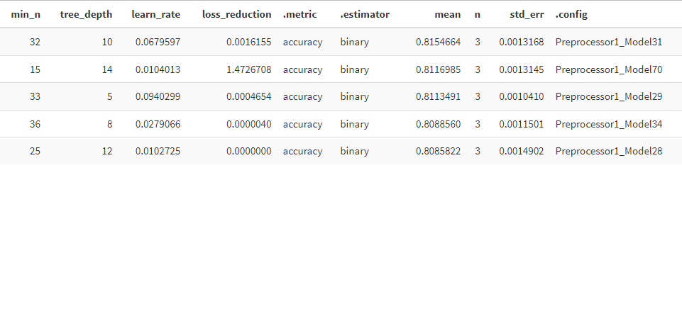

```{r setup, include=FALSE}
knitr::opts_chunk$set(echo = TRUE, warning = FALSE, message = FALSE)
```

## Librerías

Selección de todas las librerías para modelar y entrenar, desde preprocesamiento hasta validación cruzada y optimización de hiperparámetros

```{r libraries, results = FALSE}
library(tidymodels)
library(xgboost)
library(haven)
library(magrittr)
library(fs)
library(readr)
library(dplyr)
library(dials)
library(corrplot)
library(ggplot2)
library(yardstick)
library(xgboost)
library(DiagrammeR)
```

## Carga de datasets

Tenemos 5 datasets (1 por año)

```{r datasets, results=FALSE}
# Cargar la función

source("load_data.R")
dataset <- load_data()

malnutrition_14 <- dataset$malnutrition_14
malnutrition_15 <- dataset$malnutrition_15
malnutrition_14 <- dataset$malnutrition_14
malnutrition_16 <- dataset$malnutrition_16
malnutrition_17 <- dataset$malnutrition_17
malnutrition_18 <- dataset$malnutrition_18
malnutrition_19 <- dataset$malnutrition_19
```

## Analisis Exploratorio de la Data

### Correlación

En primer lugar, verificamos cómo se comportan las variables unas con otras, 
para seleccionar aquellas que no tengan tan alta correlación entre sí,
debido a que dependiendo del modelo esta colinealidad podría afectar su desempeño.


### Histogramas

Consecuentemente, queremos ver las distribuciones de las variables y comprobar si
tienen distribuciones normales o si por el contrario presentan alguna forma distinta,
de esta manera podemos escoger una estrategia de escalamiento de los datos.


### Cajas y bigotes

Finalmente, visualizamos cajas y bigotes para visualizar de forma general la cantidad
de outliers de las diferentes variables y al mismo tiempo verificar si las distribuciones
entre observaciones de niños con o sin desnutrición son similares o difieren en cuartiles,
rango, etc.


## Pre procesamiento

Seleccionamos el training y test set. En el caso del entrenamiento tomamos los años 2014 a X. Test sería el año siguiente a X.

```{r preprocess, results = FALSE}

# Training set

training_set <- data.frame(rbind(malnutrition_14, malnutrition_15, 
                                 malnutrition_16, malnutrition_17, 
                                 malnutrition_18)) %>% 
  dplyr::select(
    malnutrition, NDVI_mean, NDVI_sd, NDVI_median, NDVI_IQR, 
    NDVI_last_months, NDVI_first_months, NDVI_seasonal_diff, 
    pr_mean, pr_sd, pr_median, pr_IQR, pr_last_months, 
    pr_first_months, pr_seasonal_diff, TGAP) %>%
  mutate(malnutrition = factor(malnutrition))


# Test set

test_set <- malnutrition_19 %>%
  dplyr::select(
    malnutrition, NDVI_mean, NDVI_sd, NDVI_median, NDVI_IQR, 
    NDVI_last_months, NDVI_first_months, NDVI_seasonal_diff, 
    pr_mean, pr_sd, pr_median, pr_IQR, pr_last_months, 
    pr_first_months, pr_seasonal_diff, TGAP) %>%
  mutate(malnutrition = factor(malnutrition))

```
 
## Entrenamiento XGBoost

Escalamiento y centralización de los datosde entrenamiento.
Se utiliza un recipe para que sea utilizado también en el test set.

```{r training, results = FALSE}

# Ponemos una semilla para que los resultados sean reproducibles

set.seed(1501)

# Train test split

data_train <- training_set
data_test  <- test_set

# Crear un objeto recipe para preprocesamiento
rec <- recipe(malnutrition ~ ., data = data_train) %>%
  step_center(all_numeric()) %>%
  step_scale(all_numeric())

# Preprocesamiento
rec_preprocessed <- prep(rec)

# Aplicar receta de preprocesamiento a los datos
malnutrition_preprocessed <-
  recipes::bake(
    rec_preprocessed, 
    new_data = data_train
  ) %>%  
  rsample::vfold_cv(v = 3)

# Definir la fórmula del modelo
formula <- "malnutrition ~ ."

xgb_spec <- boost_tree(
  trees = 1000,
  tree_depth = 10,
  min_n = 32,
  loss_reduction = 1.615487e-03,
  learn_rate = 6.75973e-02) %>%
  set_engine("xgboost", nthreads = parallel::detectCores()) %>%
  set_mode("classification") %>%
  set_args(scoring = "log_loss", verbose = 1, early_stopping_rounds = 10) %>%
  set_mode("classification")

train_processed <- bake(rec_preprocessed,  new_data = data_train)

```


En esta sección se entrena el modelo, a partir de las especificaciones y la fórmula definida.

```{r training2, eval = FALSE}
# Entrenar el modelo
xgb_model_sens <- workflow() %>%
  add_model(xgb_spec) %>%
  add_formula(malnutrition ~ .) %>%
  fit(data = train_processed)
```

Aquí, generamos un objeto xgb.Booster tomando los hiperparámetros del cross-validation.

```{r training3, eval = FALSE}
# Convertir el dataframe en una matriz numérica
train_matrix <- as.matrix(data_train[, -1])  # Excluye la columna de respuesta

labels <- as.numeric(data_train$malnutrition)
labels <- ifelse(labels > 1, 1, 0)

# Convertir la matriz en un xgb.DMatrix
dtrain <- xgb.DMatrix(train_matrix, label = as.factor(data_train$malnutrition))

bst <- xgboost(data=train_matrix, 
               label = labels,
               max.depth=10, 
               eta=0.0675973, 
               nthread = 2, 
               nrounds=1000, 
               eval.metric = "error", 
               eval.metric = "logloss",
               objective = "binary:logistic")


```

## Cross validation - Hyperparameters Optimization

Utilizamos una búsqueda de valores aleatorios y dividimos 3 folds de validación.
Los hiperparámetros a configurar son: tree_depth, min_n, loss_reduction, learn_rate.

```{r cross, eval = FALSE}
# Aplicar receta de preprocesamiento a los datos
malnutrition_preprocessed <-
  recipes::bake(
    rec_preprocessed, 
    new_data = data_train
  ) %>%  
  rsample::vfold_cv(v = 3, strata = "malnutrition", breaks = 5)

# Definir la fórmula del modelo
formula <- "malnutrition ~ ."

# Definir el modelo
xgb_spec <- boost_tree(
  trees = 500,
  tree_depth = tune(),
  min_n = tune(),
  loss_reduction = tune(),
  learn_rate = tune()) %>%
  set_engine("xgboost", nthreads = parallel::detectCores()) %>%
  set_mode("classification") %>%
  set_args(scoring = "log_loss", verbose = 1, early_stopping_rounds = 10) %>%
  set_mode("classification")

# grid specification
xgb_params <- 
  dials::parameters(
    min_n(),
    tree_depth(),
    learn_rate(),
    loss_reduction()
  )

xgb_grid <- 
  dials::grid_random(
    xgb_params, 
    size = 50
  )
knitr::kable(head(xgb_grid))

xgb_wf <- 
  workflows::workflow() %>%
  add_model(xgb_spec) %>% 
  add_formula(malnutrition ~ .)


# hyperparameter tuning
xgb_tuned <- tune::tune_grid(
  object = xgb_wf,
  resamples = malnutrition_preprocessed,
  grid = xgb_grid,
  metrics = yardstick::metric_set(accuracy, precision, recall),
  control = tune::control_grid(verbose = TRUE)
)
```


Los resultados de la optimización de hiperparámetros fueron estos, evaluando el
accuracy de cada modelo, como se puede ver en la columna ".metric", y su respectivo
valor en la columna "mean"




## Evaluación del modelo XGBoost

Habiendo entrenado el modelo a partir de los parámetros encontrados por validación
cruzada, nos centramos en el accuracy y el recall.

Para ello, primero cargamos el modelo con mejor valor de recall hallado del cross validation.

```{r echo = FALSE}
xgb_model_sens <- readRDS("models/XGB/modelo_xgb__NDVI_maxsens.rds")

test_processed  <- bake(rec_preprocessed, new_data = data_test)

```
Ahora, evaluamos en el test set y observamos cómo se comporta el modelo con datos del 2019.
```{r}

# Evaluar el modelo
test_prediction <- predict(xgb_model_sens, new_data = test_processed, type = "prob") %>%
  mutate(.pred_class = if_else(.pred_1 > 0.1, "1", "0")) %>%
  bind_cols(data_test)

test_prediction %>% 
  mutate(.pred_class = as.factor(.pred_class)) %>%
  yardstick::conf_mat(malnutrition, .pred_class)

# Calcular el accuracy
accuracy <- mean(test_prediction$.pred_class == test_prediction$malnutrition)

# Calcular el recall
true_positive <- sum(test_prediction$.pred_class == "1" & test_prediction$malnutrition == "1")
false_negative <- sum(test_prediction$.pred_class == "0" & test_prediction$malnutrition == "1")
recall <- true_positive / (true_positive + false_negative)

# Mostrar los resultados
cat("\nAccuracy: ", accuracy, "\n")
cat("Recall: ", recall, "\n")
```

### Organigrama del modelo

Finalmente, para visualizar un poco el proceso de evaluación del modelo, mostramos
el organigrama del Xgboost a partir de la función xgb.plot.tree

#### Guardado de modelo
Ahora guardamos el modelo obtenido

```{r save, eval = FALSE}
xgb.save(bst, "xgboost.model")
```

#### Cargado de modelo
Cargamos el modelo nuevamente

```{r load, result = TRUE}
bst2 <- xgb.load("models/XGB/xgboost_19.model")
```

El organigrama del modelo se verá finalmente así: 

```{r}
xgb.plot.tree(model = bst2, trees = 1, plot_width = 10000, plot_height = 10000)
```

